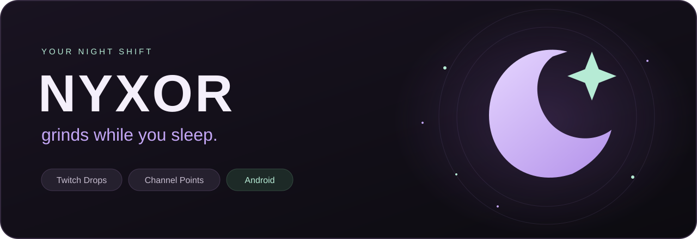
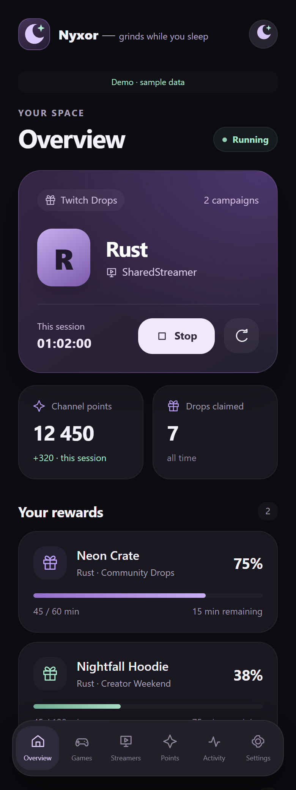
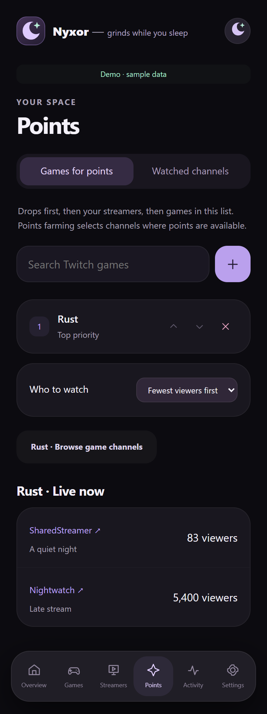
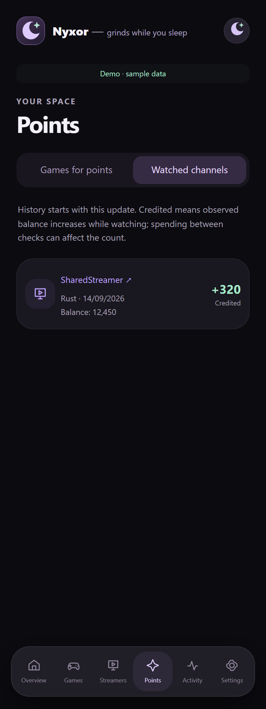
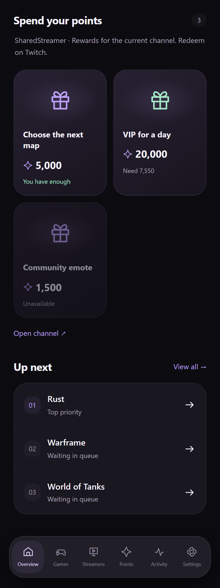

<div align="center">



**Twitch Drops and Channel Points on your Android.**<br>
Choose your games and channels, track rewards, and let NYXOR work in the background.


[](LICENSE)

**English** · [🇺🇦 Українська](README_UK.md)<br>
[Releases & APK](https://github.com/ThunderBoldX/NYXOR/releases) · [Install](#installation) · [Screenshots](#take-a-look) · [Android guide](android/README.md)

</div>

## Take a look

A dark palette, moon accents, rounded cards and smooth transitions. One place for your drops, channels and points.

<table>
  <tr>
    <td align="center" width="50%"><strong>Your night shift</strong><br><sub>Active stream, balance and Drops progress</sub></td>
    <td align="center" width="50%"><strong>Your game, your channels</strong><br><sub>Browse live channels and sort by viewer count</sub></td>
  </tr>
  <tr>
    <td align="center"></td>
    <td align="center"></td>
  </tr>
  <tr>
    <td align="center"><strong>A record of every visit</strong><br><sub>Watched channels and credited points</sub></td>
    <td align="center"><strong>Something to save for</strong><br><sub>Channel rewards, prices and points still needed</sub></td>
  </tr>
  <tr>
    <td align="center"></td>
    <td align="center"></td>
  </tr>
</table>

<sub>Actual English interface captured in demo mode. Channels, rewards, balances and progress are fictional examples. Android system bars are not shown. Ukrainian screenshots are available in the Ukrainian README.</sub>

## What NYXOR does

| | Feature |
| :--- | :--- |
| 🌙 **Android app** | Install one APK with the interface and farming engine built in. |
| 🎁 **Twitch Drops** | Campaign discovery, reward progress and automatic claiming of eligible drops. Finds a shared streamer for multiple campaigns when their requirements allow it. |
| 🎮 **Games and streamers** | Separate priority lists for Drops, named channels and points farming by game. List changes apply without restarting. |
| ✨ **Channel Points** | Balance tracking, automatic bonus claims, channel selection by viewer count and watched-channel history. |
| 🛍️ **Channel rewards** | A catalog below Drops progress shows prices, availability and what you can afford. Redeem on Twitch. |
| 🔁 **Controlled raids** | Raid destinations must match your streamers or games for points. Raids can be disabled. |
| 🔋 **Background operation** | A status notification with a stop action and optional startup after reboot. |
| 🌍 **Two languages** | Ukrainian and English, switchable in Settings. |

## Installation

Requires **Android 8.0+**, a 64-bit ARM device and an internet connection. The build also includes x86_64 for emulators.

1. Open [Releases](https://github.com/ThunderBoldX/NYXOR/releases), select a version and download its **`.apk`** under **Assets**. If an APK has not been published yet, [build it from source](android/README.md#збірка-з-вихідного-коду).
2. Open the APK on your phone. Allow installation from that source if Android asks.
3. Open NYXOR → **Settings → Connect Twitch**. Copy the code, open Twitch and confirm it. Enter your password only on Twitch’s website.
4. Add Drops categories in **Games**, specific channels in **Streamers**, or categories in **Points → Games for points**.
5. Tap **Start** on **Overview**. Allow notifications to see the status in your notification shade and on your lock screen.

Having trouble confirming the code on your phone? Open [twitch.tv/activate](https://www.twitch.tv/activate) on a computer, enter the code shown in NYXOR, then return to the app.

**Updates:** install the new APK over the existing app. Builds signed with the same key can preserve your account and settings; you do not need to uninstall first.

## How a stream is selected

```text
Available Drops for games in your list
                  ↓ otherwise
Your live streamers with Channel Points available
                  ↓ otherwise
Live channels in your “Games for points” categories
```

NYXOR uses one stream at a time. Drops campaigns determine eligible channels, so a Drops streamer may be outside your **Streamers** list. Points farming stays within your allowed channels or games and checks that points are available.

**Most viewers first / Fewest viewers first** controls the search for the next channel. When Twitch returns only part of the directory, the app labels the list as incomplete.

## Background operation

Enable startup after reboot in **Settings → Background operation**. It is off by default and requires a saved login, configured lists and the phone’s first unlock after reboot.

Allow unrestricted battery use for NYXOR if your phone offers that option. Closing the app window does not stop the service, but **Force stop** or a manufacturer’s memory cleaner may require opening it manually. See the [Android guide](android/README.md) for details.

## A few things to know

- **2.2.0 is a preview.** Local builds and automated checks have passed; extended use, new features and behavior across different phones still need practical testing.
- **Points history starts with version 2.2.** It records observed balance increases while watching. Spending between checks can affect the count.
- **Rewards are not purchased automatically.** The catalog shows the current channel’s offerings; redemption happens on Twitch.
- **Your data stays on your device.** The APK stores login data, lists and history in its private app directory. Keep tokens, cookies, logs and signing keys out of the repository.
- NYXOR is an independent, unofficial project and is not affiliated with Twitch. Drops and points availability depends on Twitch and the requirements of each campaign or channel.

## Development and support

| Link | Contents |
| :--- | :--- |
| [Android guide](android/README.md) | Installation, background service, diagnostics and APK build instructions, in Ukrainian |
| [Development](docs/DEVELOPMENT.md) | Repository structure, shared engine and local checks |
| [Changelog](docs/CHANGELOG.md) | Project changes |
| [Publishing on GitHub](docs/PUBLISHING.md) | Repository, screenshots and APK release checklist, in Ukrainian |
| [Report an issue](https://github.com/ThunderBoldX/NYXOR/issues) | Include NYXOR version, phone model, Android version and steps to reproduce |

Distributed under the [MIT License](LICENSE).

<div align="center">

🌙 **Nyxor — grinds while you sleep.**

</div>
