<div align="center">

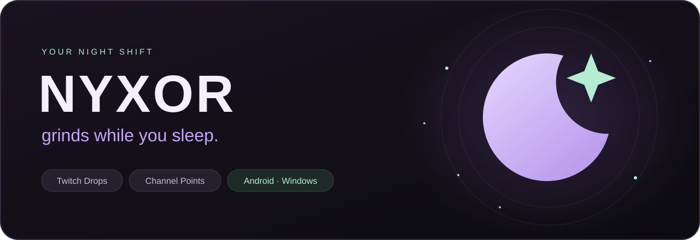

**Twitch Drops і Channel Points на Android та Windows.**<br>
Обирай ігри та канали, стеж за нагородами й залишай NYXOR працювати у фоні.


[](LICENSE)

**🇺🇦 Українська** · [English](README.md)<br>
[Релізи та APK](https://github.com/ThunderBoldX/NYXOR/releases) · [Встановлення](#встановлення) · [Скріншоти](#зазирни-всередину) · [Збірка APK](android/README.md#збірка-з-вихідного-коду)


**[Завантажити Android 2.4.0 preview](https://github.com/ThunderBoldX/NYXOR/releases/tag/v2.4.0-preview)**

</div>

## Зазирни всередину

### Windows preview

Той самий стиль і ядро у вікні для ПК: бічне меню, керування з трея та автозапуск після входу у Windows. Потрібна **Windows 10/11 x64** та **Google Chrome для входу Twitch**. Локальний інсталятор 2.4.2 preview готовий; публічний Windows-реліз ще не опублікований.

Вікно відкривається розгорнутим у межах робочої області поточного монітора. Для автозапуску можна вибрати лише відкриття NYXOR або ще й запуск фарму. Пошук ігор використовує публічний каталог Twitch, з обкладинками та активними каналами для поїнтів.

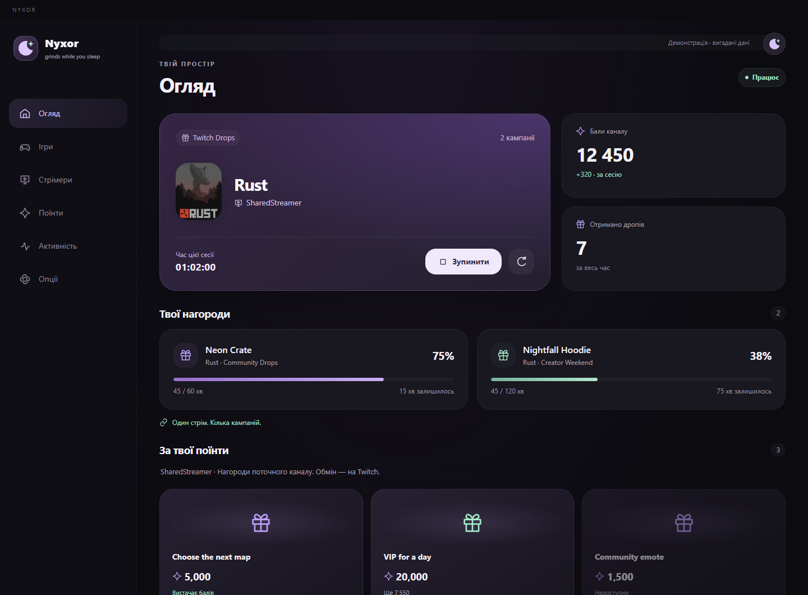

Кілька Twitch-акаунтів можуть фармити одночасно: у кожного окремий вхід, списки, прогрес та історія. Розділ «Акаунти» й перемикач показують, чий профіль відкритий. Інсталятор автоматично запитує права адміністратора. Chrome закривається після входу; фарм використовує збережений сеанс. Є режим мінімального навантаження та згортання у трей з відкриттям одним кліком.

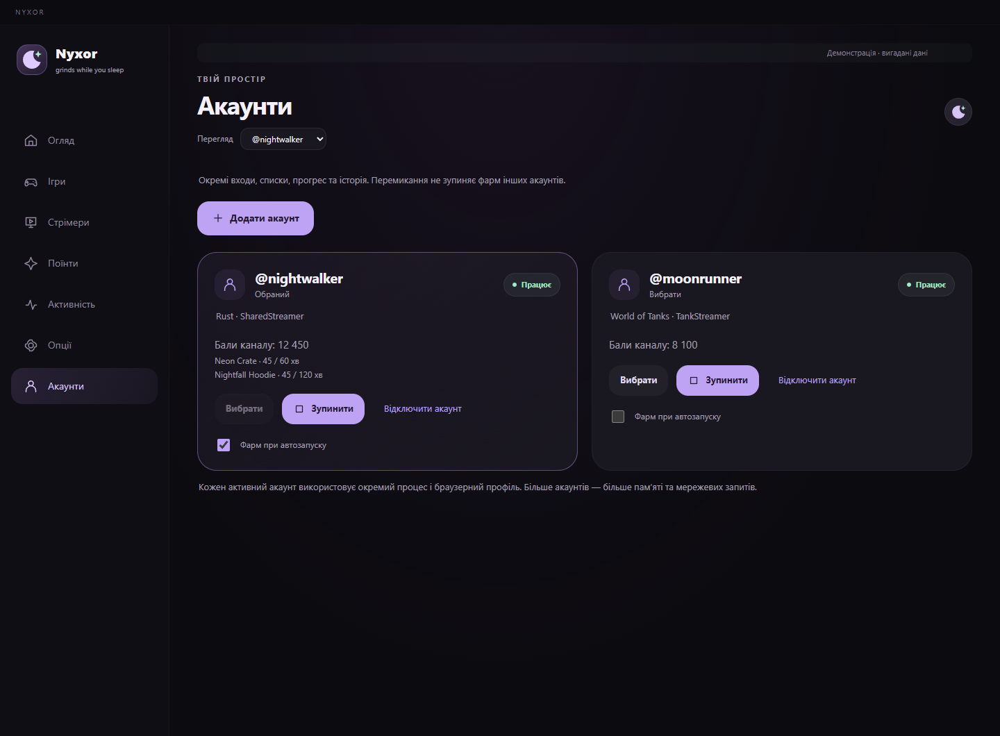

[Встановлення Windows-версії](desktop/README_UK.md) · [Скриншот налаштувань ПК](docs/screenshots/windows/uk/settings.png)

### Android

Темна палітра, місячні акценти, округлі картки та плавні переходи. Один простір для дропів, каналів і поїнтів.

<table>
  <tr>
    <td align="center" width="50%"><strong>Твоя нічна зміна</strong><br><sub>Активний стрім, баланс і прогрес Drops</sub></td>
    <td align="center" width="50%"><strong>Твоя гра — твої канали</strong><br><sub>Пошук каналів і порядок за кількістю глядачів</sub></td>
  </tr>
  <tr>
    <td align="center">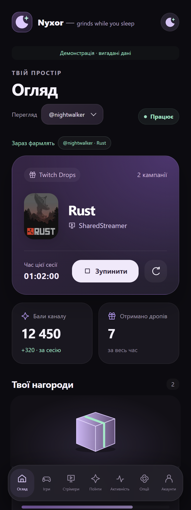</td>
    <td align="center">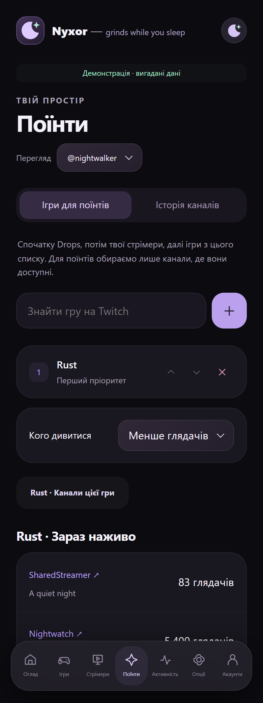</td>
  </tr>
  <tr>
    <td align="center"><strong>Керуй своєю історією</strong><br><sub>Вибір каналів і видалення записів історії</sub></td>
    <td align="center"><strong>Поїнти мають ціну</strong><br><sub>Нагороди каналу та скільки ще потрібно накопичити</sub></td>
  </tr>
  <tr>
    <td align="center">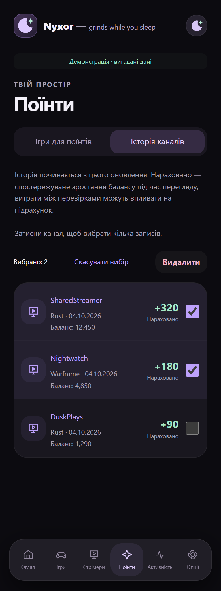</td>
    <td align="center">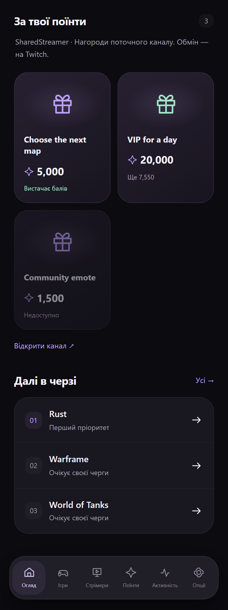</td>
  </tr>
  <tr>
    <td align="center"><strong>Нагороди за грою</strong><br><sub>Відфільтруй отримані дропи</sub></td>
    <td align="center"><strong>Твій режим батареї</strong><br><sub>Енергозбереження в налаштуваннях</sub></td>
  </tr>
  <tr>
    <td align="center">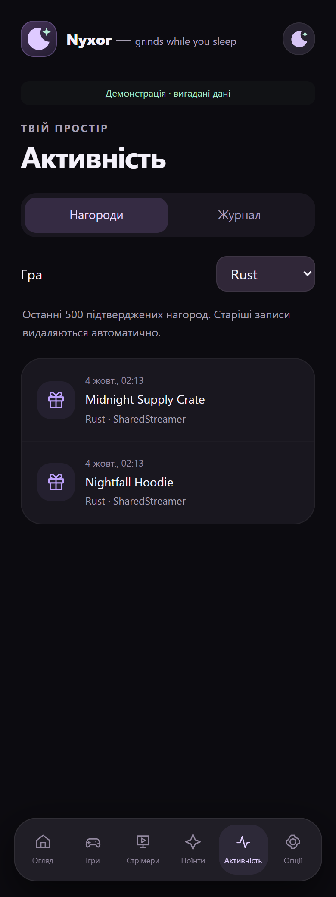</td>
    <td align="center">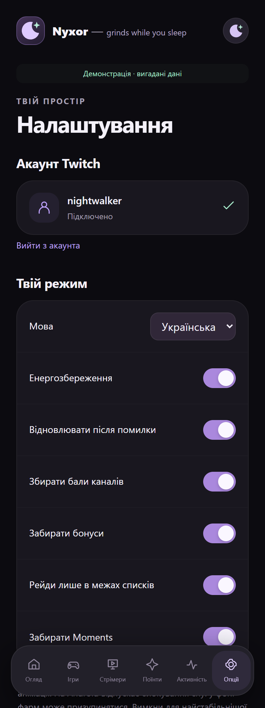</td>
  </tr>
  <tr>
    <td align="center"><strong>Окремі акаунти</strong></td>
    <td align="center"><strong>Вибір і видалення профілів</strong></td>
  </tr>
  <tr>
    <td align="center">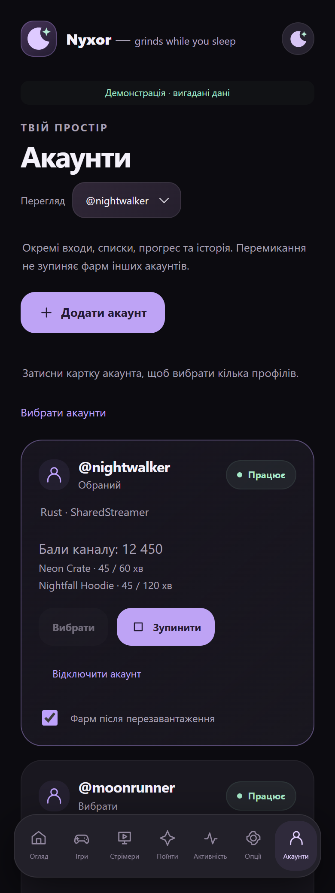</td>
    <td align="center">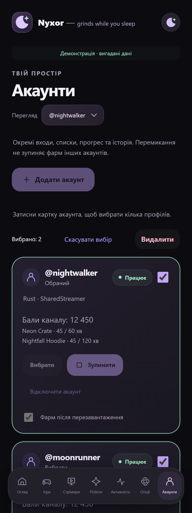</td>
  </tr>
</table>

<sub>Скріншоти справжнього інтерфейсу в демонстраційному режимі. Канали, винагороди, баланси й прогрес — вигадані приклади; системні панелі Android не показані.</sub>

## Що вміє NYXOR

| | Можливість |
| :--- | :--- |
| 🌙 **Android-застосунок** | Один APK із готовим інтерфейсом та вбудованим ядром фарму. |
| 🎁 **Twitch Drops** | Пошук кампаній, прогрес нагород і автоматичне отримання доступних дропів. Вибір спільного стрімера для кількох кампаній, коли їхні умови це дозволяють. |
| 🎮 **Ігри та стрімери** | Окремі пріоритетні списки для Drops, конкретних каналів і фарму поїнтів за грою. Зміни підхоплюються без перезапуску. |
| ✨ **Channel Points** | Баланс, автоматичний збір бонусів, вибір каналів за кількістю глядачів та історія переглядів. |
| 🛍️ **Нагороди каналу** | Каталог із цінами й доступністю під прогресом Drops. Видно, на що вистачає балів; обмін відбувається на Twitch. |
| 🔁 **Керовані рейди** | Перехід лише в межах твоїх стрімерів або ігор для поїнтів. Рейди можна вимкнути. |
| 🔋 **Робота у фоні** | Повідомлення зі станом фарму, зупинка зі шторки та необов’язковий автозапуск після перезавантаження. |
| 🌍 **Дві мови** | Українська й англійська, перемикання в налаштуваннях. |

## Нове в Android 2.4.0

- Окремі акаунти зі своїми входами, списками, фармом, історією та журналом. Перемикання не зупиняє інші акаунти.
- Затискання картки для вибору кількох профілів, видалення й скасування вибору.
- Картинки предметів із Twitch у поточних дропах та інвентар отриманих нагород із фільтром гри.
- Округлі анімовані дропдауни та рідші оновлення екрана в енергозбереженні.

[Завантажити Android 2.4.0 preview APK](https://github.com/ThunderBoldX/NYXOR/releases/tag/v2.4.0-preview). Встановлюй поверх 2.3.1 без видалення: сертифікат підпису не змінився.

[Скриншот вибору акаунтів](docs/screenshots/accounts-selection.png) · [Інструкція акаунтів Android](android/README.md)

## Нове у 2.3.1

- Плавний контур місяця та значок налаштувань по центру кнопки.
- Обкладинка гри з Twitch замість першої літери на картці поточного стріму.
- Затисни канал в історії, вибери записи галочками й видали їх. Список «Стрімери» не змінюється.
- Кожен підтверджений дроп зберігається окремо. В активності — останні 500 нагород і фільтр за грою.
- **Енергозбереження** зменшує частоту перевірок та оновлень екрана, вимикає зайві анімації. На Android дозволяє процесору засинати, тому фоновий фарм може призупинятися. Вимкни для стабільнішої роботи; фактична економія залежить від телефона й мережі.

## Встановлення

Потрібні **Android 8.0+**, 64-бітний ARM-пристрій та інтернет. Збірка також містить x86_64 для емуляторів.

1. Відкрий [Releases](https://github.com/ThunderBoldX/NYXOR/releases), вибери потрібну версію та завантаж файл **`.apk`** у розділі **Assets**. Якщо APK ще не опубліковано, його можна [зібрати з вихідного коду](android/README.md#збірка-з-вихідного-коду).
2. Відкрий APK на телефоні. Якщо Android попросить, дозволь встановлення з цього джерела.
3. Запусти NYXOR → **Опції → Підключити Twitch**. Скопіюй код, відкрий Twitch і підтвердь його. Пароль вводиться тільки на сайті Twitch.
4. Додай ігри для Drops у **«Ігри»**, канали у **«Стрімери»** або категорії у **«Поїнти → Ігри для поїнтів»**.
5. На екрані **«Огляд»** натисни **«Запустити»**. Дозволь повідомлення, щоб бачити стан роботи у шторці та на екрані блокування.

Не виходить підтвердити код у браузері телефона? Відкрий [twitch.tv/activate](https://www.twitch.tv/activate) на ПК та введи код із NYXOR, потім повернися в застосунок.

**Оновлення:** встановлюй новий APK поверх попереднього. Однаковий підпис збірок дозволяє зберегти акаунт і налаштування; видаляти застосунок перед оновленням не потрібно.

## Як обирається стрім

```text
Доступні Drops для ігор із твого списку
                  ↓ якщо немає
Твої онлайн-стрімери з доступними Channel Points
                  ↓ якщо немає
Канали в іграх зі списку «Ігри для поїнтів»
```

NYXOR використовує один стрім за раз. Для Drops канал визначається умовами кампанії, тому він може відрізнятися від списку **«Стрімери»**. Для поїнтів беруться лише дозволені канали або ігри, де доступні бали.

Порядок **«Більше глядачів» / «Менше глядачів»** визначає пошук наступного каналу. Якщо Twitch повернув лише частину каталогу, застосунок позначає список як неповний.

## Фонова робота

У **«Опції → Робота у фоні»** можна ввімкнути автозапуск після перезавантаження. Він вимкнений за замовчуванням; для старту потрібні збережений вхід, налаштовані списки та перше розблокування телефона.

Дозволь NYXOR працювати без обмежень батареї, якщо телефон має таку опцію. Звичайне закриття вікна не зупиняє службу, але **«Примусово зупинити»** або очищувач виробника можуть вимагати ручного відкриття застосунку. Деталі — в [інструкції Android](android/README.md#автозапуск-і-фонова-робота).

## Варто знати

- **Android 2.4.0 — preview.** Локальну збірку й автоматичні перевірки виконано; тривала робота, нові функції та поведінка різних телефонів потребують практичного тестування.
- **Історія поїнтів починається з версії 2.2.** Вона рахує спостережуване зростання балансу під час перегляду. Витрати між перевірками можуть впливати на точність.
- **Нагороди не купуються автоматично.** Каталог показує пропозиції поточного каналу, а обмін виконується на Twitch.
- **Дані зберігаються на пристрої.** Вхід, списки й історія APK лежать у приватній папці застосунку. Не додавай до репозиторію токени, cookies, журнали або ключі підпису.
- NYXOR — незалежний неофіційний проєкт, не пов’язаний із Twitch. Доступність Drops і поїнтів залежить від Twitch та умов конкретної кампанії або каналу.

## Розробка та підтримка

| Посилання | Що всередині |
| :--- | :--- |
| [Android: встановлення й збірка](android/README.md) | Вимоги, фонова служба, діагностика та збірка APK |
| [Розробка](docs/DEVELOPMENT.md) | Структура репозиторію, спільне ядро й локальні перевірки |
| [Історія змін](docs/CHANGELOG.md) | Попередні зміни проєкту |
| [Публікація на GitHub](docs/PUBLISHING.md) | Як додати код, скріншоти та APK до релізу |
| [Повідомити про проблему](https://github.com/ThunderBoldX/NYXOR/issues) | Додай версію NYXOR, модель телефона, Android і кроки відтворення |

Код розповсюджується за [ліцензією MIT](LICENSE).

<div align="center">

🌙 **Nyxor — grinds while you sleep.**

</div>
