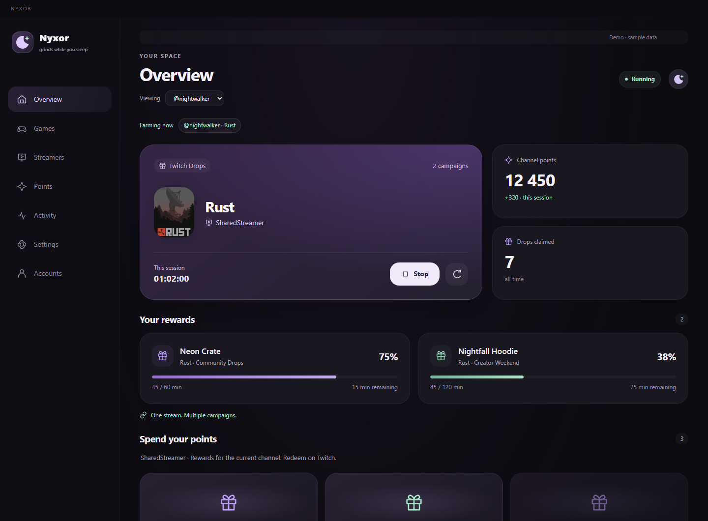
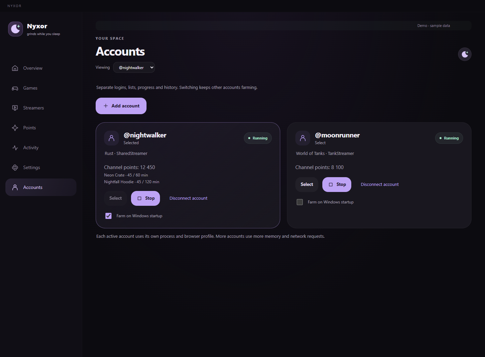

# NYXOR for Windows

[Project](../README.md) · [Українська](README_UK.md)

The same moon, colors, cards, animations and farming engine as Android, adapted to a desktop window with a sidebar. This is the **2.4.0 Windows preview**, for **Windows 10/11 x64**. Other desktop operating systems are not packaged or tested.



Screenshots show the actual interface in demo mode; channels, balances and rewards are fictional examples. The installed app starts with an empty account and your own lists.

## Install and use

1. Run `NYXOR-Windows-2.4.0-preview-Setup.exe`, approve the Windows administrator prompt and choose your installation directory. Python and Node.js are bundled. **Google Chrome must be installed for Twitch login.**
2. Open NYXOR from Start or the desktop shortcut. In **Settings → Connect Twitch**, sign in on Twitch in the separate Chrome window. NYXOR verifies the account and protected Drops catalog before saving the session. Enter your password only on Twitch's website.
3. Add Drops categories in **Games**, channels in **Streamers**, or categories in **Points → Games for points**. Press **Start farming** on Overview.
4. Closing the window hides it in the system tray. Double-click the moon to reopen it; right-click for start, stop and quit.

The locally built installer is unsigned. Windows may display an unknown-publisher confirmation. There is no Windows release download link until the installer is published.

**2.4.0 setup:** the installer requests administrator permission at launch and installs for all users. It checks selected and previous installation folders before updating, including older per-user installations under Program Files. The app itself runs without administrator privileges. Existing account data remains in its separate user directory.

**2.3.4:** the status and moon shortcut sit beside each other. Opening NYXOR maximizes it on the display under the cursor, using Windows' work area and display scaling so the taskbar remains accessible. You can restore and resize the window normally.

Both **Games** and **Points → Games for points** search Twitch's public catalog without requiring a saved login. For example, `World Of Tanks` finds the canonical `World of Tanks` category. Desktop artwork and live channel discovery also use Twitch's website catalog. Farming still requires a connected account. Search distinguishes no matches, offline requests, rate limits and Twitch errors.

**2.3.2 installer fix:** setup checks only the app and engine executables in the selected installation directory, excluding setup, the uninstaller and unrelated programs. Updates request a graceful shutdown and close orphan engines when needed. A process-inspection or permission error has a separate message. For installation into Program Files, Windows administrator permissions are required.

## Accounts



1. Open **Accounts → Add account**, then **Connect Twitch** on its card. Each profile uses its own Chrome window and saved login.
2. Add that account's games or streamers, then press **Start** on its card or Overview. Repeat for another account to farm concurrently.
3. Use **Select** or the **Viewing account** dropdown to switch profiles. Other accounts keep farming. The Overview badges and Accounts cards show each account's game, channel and progress; lists, history and Activity belong to the selected profile.
4. **Disconnect account** signs out only that profile. **Quit NYXOR** stops all profiles.

Up to 20 profiles can be saved. A duplicate Twitch identity cannot start farming in two profiles. More active accounts require more memory and network traffic; each has its own backend process and browser profile.

For automatic farming after Windows login, enable **Start with Windows → Start NYXOR and farm**, then check **Farm on Windows startup** on the desired account cards. The original profile keeps its previous startup behavior; newly added profiles are not opted in. **Start NYXOR only** starts no farming profiles.

## Background and power

- **Start with Windows** is off by default. Enable it and choose **After startup → Start NYXOR only** or **Start NYXOR and farm**. Both open the installed app in the tray after Windows login; farming additionally requires Twitch to be connected and at least one saved list. Previously enabled startup keeps its farming behavior. This is Windows login startup, not a service running before login.
- Normal mode prevents automatic system sleep while farming and still permits the display to turn off. Manual sleep, shutdown or loss of network access pauses farming.
- **Energy saver** uses the shared engine's slower network checks and screen updates and reduces animations. It also allows Windows to sleep. Savings depend on the hardware and network.
- Hover over the tray icon for active accounts, games and channels. Tray start/stop controls the selected account. Selecting **Quit NYXOR** stops all engines and exits.

A separate Chrome profile is stored in `%APPDATA%\nyxor-desktop\twitch-profile`; your personal browser profile is never used. The owned Chrome window is minimized after login and retained for Twitch session renewal. NYXOR closes it when farming is stopped or the app exits, and reopens it minimized on the next start. Signing out clears the owned profile. Existing Android-client sessions are preserved and do not require Chrome while valid.

The original account keeps `%APPDATA%\nyxor-desktop\engine` and its existing Chrome profile. Additional profiles store their data under `%APPDATA%\nyxor-desktop\accounts\<profile-id>\engine`, with a separate `twitch-profile` beside each engine folder. The private `accounts.json` index stores selection, startup preferences and public identity; it does not contain OAuth tokens. Windows and Android accounts/settings are independent; no automatic synchronization is implemented.

## Build from source

Build on Windows x64 with **Python 3.12**, **Node.js 24** and npm. From the repository root:

```powershell
py -3.12 -m venv .venv
.\.venv\Scripts\python.exe -m pip install -r desktop/requirements-build.txt
.\desktop\scripts\build-engine.ps1 -Python .\.venv\Scripts\python.exe
cd desktop
npm ci
npm run dist
```

The installer appears in `desktop/dist/`; the unpacked app is in `desktop/dist/win-unpacked/`. Do not commit generated builds or private user data. Electron and builder versions are pinned in the lockfile. Signing a public release requires the maintainer's Windows signing certificate; none is included in this repository.

For development, build the engine or set `NYXOR_PYTHON` to your Python executable, then run `npm start` in `desktop/`. Development mode disables enabling Windows startup. Assets in `generated/ui/` are copied from the Android frontend and supplemented with desktop layout and text; edit the source files, not generated files.

## Checks

```powershell
$env:PYTHONPATH = (Resolve-Path core).Path
.\.venv\Scripts\python.exe -m unittest discover -s tests -v
node --test desktop/tests/*.test.cjs
powershell -NoProfile -ExecutionPolicy Bypass -File desktop/tests/installer-paths.ps1
.\.venv\Scripts\python.exe desktop/tests/installer-privileges.py
```

After packaging, set `NYXOR_NSIS_COMPILER` to the downloaded `makensis.exe` and run `node desktop/tests/installer-integration.cjs` on Windows. It checks graceful update shutdown and runs the compiled NSIS process-check macro against temporary orphan/unrelated processes in `.local/installer-tests/`; no application installation, registry or shortcut changes are made.

To check the frozen engine too, set `NYXOR_TEST_ENGINE` to the absolute path of `desktop/engine/nyxor-engine/nyxor-engine.exe` and rerun `test_desktop_backend.py`. The tests use temporary data without Twitch credentials.

The packaged executable accepts `--smoke-dir=ABSOLUTE_PATH` for an isolated integration check. It writes a result and screenshots, makes no Windows startup changes, and exits. This checks the native bridge, embedded engine, saved lists/settings and window layout, without connecting a real account.

Add `--smoke-catalog` to check live `World Of Tanks` search and adding its canonical category in both Games and Points, without using account credentials. The 2.3.4 checks also cover work-area sizing, separate header controls, both saved startup modes and public catalog pagination/artwork. Automated fixtures cover six screen sizes, including display scaling and a small work area.

Optional screenshot capture: install Playwright separately, run `node desktop/scripts/prepare-ui.cjs`, then `node tools/capture_desktop_screenshots.cjs`. `BROWSER_EXECUTABLE` can select an installed Chromium browser. It captures English and Ukrainian screens and checks navigation, filters, selection and layout at several widths.

Live Twitch login, real claim completion, tray use over extended sessions, login startup after a reboot and sleep/resume still require practical user testing. The automated checks do not claim those live outcomes.

## Session renewal in 2.4.0

Renewal accepts a still-valid proof already issued to the owned Chrome profile only after observing a fresh successful protected catalog request with matching headers. Transient background failures retain the browser profile and retry with delays from 15 seconds to 2 minutes. A disconnected owned Chrome process is replaced without touching your personal browser. Pending renewal and errors are visible for each account.

If Twitch revokes the login or the owned browser signs in to a different account, reconnect that profile. This cannot guarantee indefinite login or repair a revoked session automatically. Overnight renewal and simultaneous farming with real Twitch accounts still require practical testing.

## Twitch login recovery in 2.3.3

The old Android device-code client currently returns HTTP 400 `invalid client`. Repeated network checks do not fix it. Desktop login now uses native Chrome with a dedicated NYXOR profile, checks both account identity and the protected campaign list, and refreshes the matching web request context before Twitch’s expiry. No password, OAuth token or integrity context is sent to the application renderer. Failed validation preserves the prior saved login.

This approach is informed by the [upstream login investigation](https://github.com/rangermix/TwitchDropsMiner/issues/118). It uses the browser’s issued context, without generating substitute integrity proofs. If Chrome is missing, closed, or a session cannot be refreshed, Settings explains the error and offers reconnect/cancel controls. Live interactive login on this Windows machine and overnight renewal still need user verification.

Run `node desktop/tests/twitch-login-smoke.cjs` to test actual Chrome ownership, separate empty profile and cleanup without an account. Add `--smoke-login` to a packaged `--smoke-dir=...` check to exercise the pending/cancel UI and backend flow.
